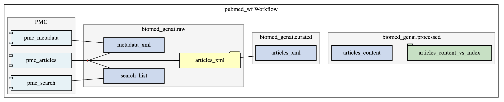
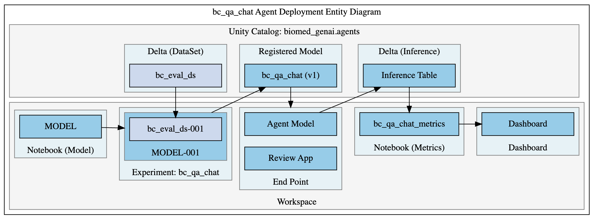

# biomed_genai

The **biomed_genai** project is a solution accelerator that will provide convention on how to contruct a Enterprise Grade Generative AI Application. The folder structure of the git project as well as conventions around application configurations management are intended not to show off Databricks components, but how to structure applications to facilitate Enterprise CI/CD deployment patterns and LLMOps Governanace.

### Code Categories

At the first level there are two folders in root that categorize code:
 * databricks - This folder contains the notebooks and configurations to build application component within a databricks environment.

 * python - This folder will contain modularize, reusable code. It is organized in such a way that if required, it can be packaged and deployed as a python wheel file. Organizing reusable, modularized code in this way will simplify unit testing, system integration testing, and package release management. 

### Application Component Categories

Within Generative AI projects, we'll use three Application Component Categories within both code categories:

 * **workflow** - This is where we consolidate the genai workflows within the project. These will include both workflows that are a data curation that lead to a retriever that can be a dependency in an agent or model fine-tuning or a workflow to apply an agent. Workflows withing this directory can typically be developed and maintained by a data engineer with collaboration from a GenAI Data Scientist during the first iteration.
 * **model** - This is where we consolidate the models used within the project. In this case we are refering to models types of embedding, chat, and completion. We are explicitly excluding agent models which will actually use models as dependencies.
 * **agent** - This is where we maintain the agent that

**NOTE**: This project doesn't include the application front end development since this can be done by many different frameworks and is deployed outside of Databricks. However, for consolidation of project code, it would be viable to maintain the application web frontend inside this project structure. It is also viable to maintain in a separate version controlled project. Follow existing conventions where applicable.

# Project Applications

 * pubmed_wf - This includes the workflow tasks to populate a vector store with PubMed articles content. It is initially configured for only articles specific to Breast Cancer, but is intended to be arguemented for any additional articles if interest. 
   * 

 * bc_qa_char - This agent is a bot that will support researchers in the area of Breast Cancer research.
   * 